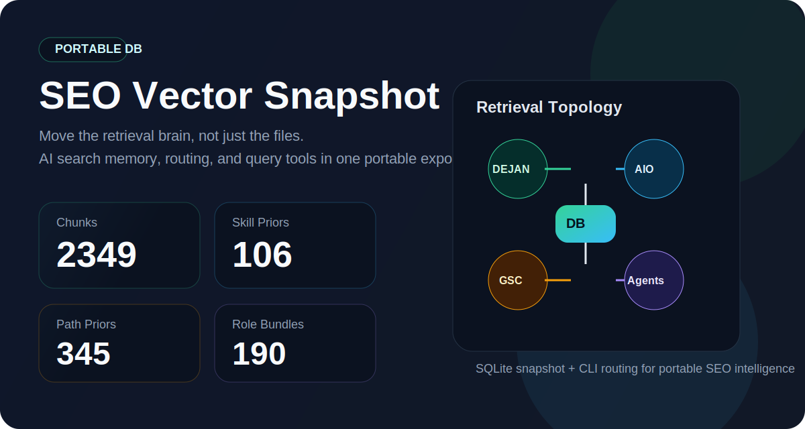
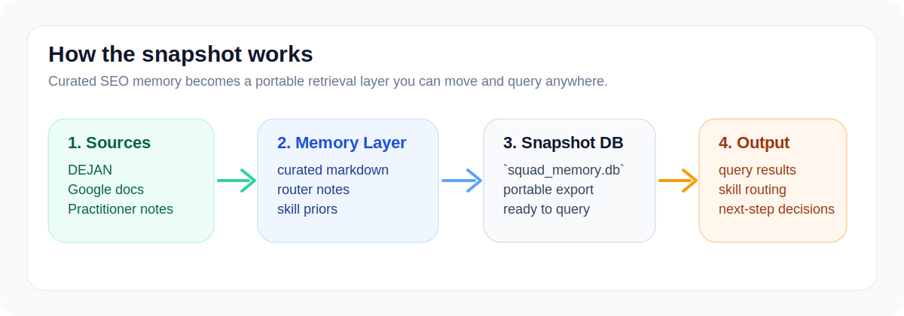

<p align="center">
  
</p>

# SEO Vector Snapshot

Portable SEO memory graph for AI search, technical SEO, and multi-agent workflows.

This is not a backup of notes.

It is the working retrieval layer behind my local SEO squad: a portable SQLite snapshot, learned routing priors, task-pack logic, and CLI + MCP access for Codex, Claude Code, OpenClaw, and shell-capable agents.

If your SEO workflow touches AI Overviews, grounding, AI Mode, technical audits, or reverse engineering, this repo gives you the part of the system that remembers.

## Current Refresh

This snapshot now reflects the newer corpus shape behind the squad:

- the DB has been rebuilt against the stricter reputable-source freshness layer
- archive backfill from secondary reputable sources is now represented in the corpus without polluting the main live monitor
- snapshot metadata has been updated to the current graph size and prior counts
- the portable CLI remains intact, so the repo still works off-machine

## Why This Repo Feels Different

Most SEO research dies in tabs, loose docs, and half-recalled “I saw this somewhere” moments.

This repo turns that mess into a portable memory layer:

- not a raw vector dump, but a retrieval system with query tooling and task packs
- not generic SEO text, but practitioner-shaped memory built from live research and curation
- not locked to one runtime, but usable through CLI, Claude skills, and native MCP tools
- not another restart-from-zero setup, but a handoff-ready memory graph for the next laptop or operator

## What Makes It Valuable

- preserves working SEO context instead of forcing fresh research every session
- moves a trained retrieval layer between machines in minutes
- exposes the same memory through multiple access layers: `CLI`, `MCP`, `Claude skills`, and `task packs`
- pairs with [`seo-skills-pack`](https://github.com/vijaychauhanseo/seo-skills-pack) so retrieval becomes decisions, not just search hits
- now reflects a tiered corpus with a strict live source layer plus slower archive backfill, so the graph can grow without turning freshness into noise

## Platform Support

| Platform | Status | How To Use |
| --- | --- | --- |
| Codex | Ready | direct CLI + companion skills repo |
| Claude Code / Claude CLI | Ready | installer adds user memory and query skills |
| OpenClaw | Ready through mirrored import/indexing | use imported files or sync |
| Other shell-capable agents | Ready | run the bundled Python CLI directly |

## Snapshot At A Glance

| Metric | Value |
| --- | ---: |
| Captured | `2026-03-20` |
| Chunks | `2978` |
| Learned path priors | `409` |
| Learned skill priors | `110` |
| Learned pack priors | `21` |
| Role bundles | `207` |

<p align="center">
  
</p>

## What Is Inside

- `db/squad_memory.db`
  - the portable retrieval snapshot
- `tools/squad_memory.py`
  - the query and routing CLI
- `tools/task_packs.json`
  - task-pack metadata used by the CLI
- `scripts/install_snapshot.sh`
  - one-command installer for another laptop
- `scripts/install_to_claude.sh`
  - installs Claude-ready query skills and user memory
- `snapshot.json`
  - export metadata for this snapshot

## What You Can Use It For

- recover prior research on AI search, grounding, citations, and AI Overviews
- route a prompt toward the right SEO skill, practitioner, or memory pack
- move a working retrieval graph to a second laptop without rebuilding from scratch
- pair the DB with the companion [`seo-skills-pack`](https://github.com/vijaychauhanseo/seo-skills-pack) for interpretation and execution

## What Changed In This Refresh

- refreshed the DB snapshot to the current live corpus size
- aligned the snapshot with the stricter reputable-source freshness layer
- captured the newer archive-backfill growth from secondary reputable sources
- kept the portable toolchain intact so the repo still works off-machine

## Current Corpus Shape

Strict live freshness sources:

- Google Search Central
- Ahrefs
- DEJAN
- GSQi
- Marie Haynes
- Lily Ray
- MobileMoxie
- Brodie Clark
- iPullRank
- Jono Alderson

Archive backfill sources represented through the companion memory layer:

- Hobo
- Aleyda Solis
- Search Engine Land
- Search Engine Journal
- Search Engine Roundtable

## Quick Start

Clone the repo and query it in place:

```bash
git clone https://github.com/vijaychauhanseo/seo-vector-snapshot.git
cd seo-vector-snapshot
python3 tools/squad_memory.py query "selection rate grounding snippets" --db db/squad_memory.db
```

Install it to a local folder:

```bash
./scripts/install_snapshot.sh
```

Default install target:

- `~/squad_memory-portable`

Override the target:

```bash
./scripts/install_snapshot.sh /path/to/portable-memory
```

## Quick Start For Claude Code Or Claude CLI

Install the Claude adapter:

```bash
./scripts/install_to_claude.sh
```

This creates:

- a user memory import in `~/.claude/CLAUDE.md`
- `/seo-vector-query`
- `/seo-skill-router`

After install, you can ask Claude to run:

```text
/seo-vector-query grounding snippets and selection rate
/seo-skill-router diagnose an AI Mode citation loss investigation
```

## Use As A Native MCP Server

This repo now ships with a portable stdio MCP server:

- `mcp/seo_memory_mcp_server.py`

It exposes these MCP tools:

- `seo_memory_query`
- `seo_skill_route`
- `seo_task_pack`
- `seo_execution_plan`
- `seo_snapshot_info`

### Add To Claude Code

If you have the Claude CLI installed:

```bash
./scripts/install_mcp_for_claude.sh
```

Or add it manually:

```bash
claude mcp add seo-memory --scope user -- \
  python3 /absolute/path/to/seo-vector-snapshot/mcp/seo_memory_mcp_server.py \
    --db /absolute/path/to/seo-vector-snapshot/db/squad_memory.db \
    --skills-root /absolute/path/to/skills-root \
    --task-packs /absolute/path/to/seo-vector-snapshot/tools/task_packs.json
```

Manual config example:

- `mcp/claude.mcp.json.example`

### Why MCP Matters

The CLI already works for shell-capable agents.

The MCP server makes the same retrieval layer available to clients that prefer native tool calling over local shell commands. That includes Claude Code and other MCP-aware agent runtimes.

## Pair It With The Skills Pack

If the companion skills repo is not installed into `~/.codex/skills`, point the CLI at the cloned skills directory:

```bash
SQUAD_MEMORY_SKILLS_ROOT=../seo-skills-pack/skills \
python3 tools/squad_memory.py decide \
  "Need DEJAN-style AI search reverse engineering" \
  --db db/squad_memory.db
```

## Example Queries

```bash
python3 tools/squad_memory.py query "Gemini grounding classifier" --db db/squad_memory.db
python3 tools/squad_memory.py query "AI Mode page indexing and content store" --db db/squad_memory.db
python3 tools/squad_memory.py decide "Need a practitioner for core update plus AI Overviews" --db db/squad_memory.db
```

## Who This Is For

- technical SEOs building local research systems
- AI-search analysts who want portable memory, not fresh tab chaos
- operators moving a working Codex, Claude, or OpenClaw setup between laptops
- founders building internal retrieval before full productization

## Why It Is Public

Most public SEO repos share templates, prompt fragments, or scripts.

This one shares a working memory layer.

The point is to show what happens when SEO research is treated like infrastructure: stored, routed, queried, and made portable across tools instead of disappearing after the session ends.

## Portability Notes

- the bundled `tools/squad_memory.py` has been patched to avoid a hardcoded `/Users/vijaychauhan` dependency
- the DB snapshot is portable and can be queried in place
- no secrets are stored in this repository
- the CLI can be called by any agent that can run local shell commands

## Companion Repository

The instruction and memory layer that pairs with this DB lives here:

- [`seo-skills-pack`](https://github.com/vijaychauhanseo/seo-skills-pack)

Use this repo for retrieval.
Use the skills repo for interpretation, routing, and operator context.

## Social Preview Asset

If you want a custom GitHub social preview card for this repo, use:

- `assets/social-preview.png`

## Claude Adapter Files

Claude-specific files live under:

- `adapters/claude-code/`
- `mcp/`

## License

MIT. See [`LICENSE`](LICENSE).
